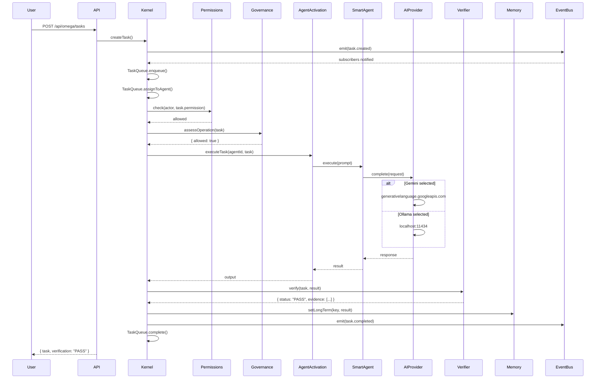
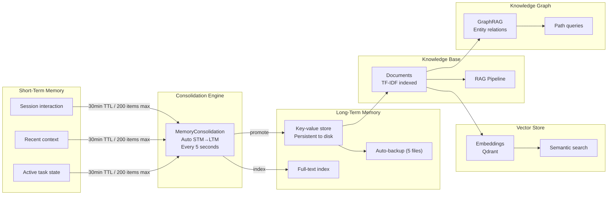
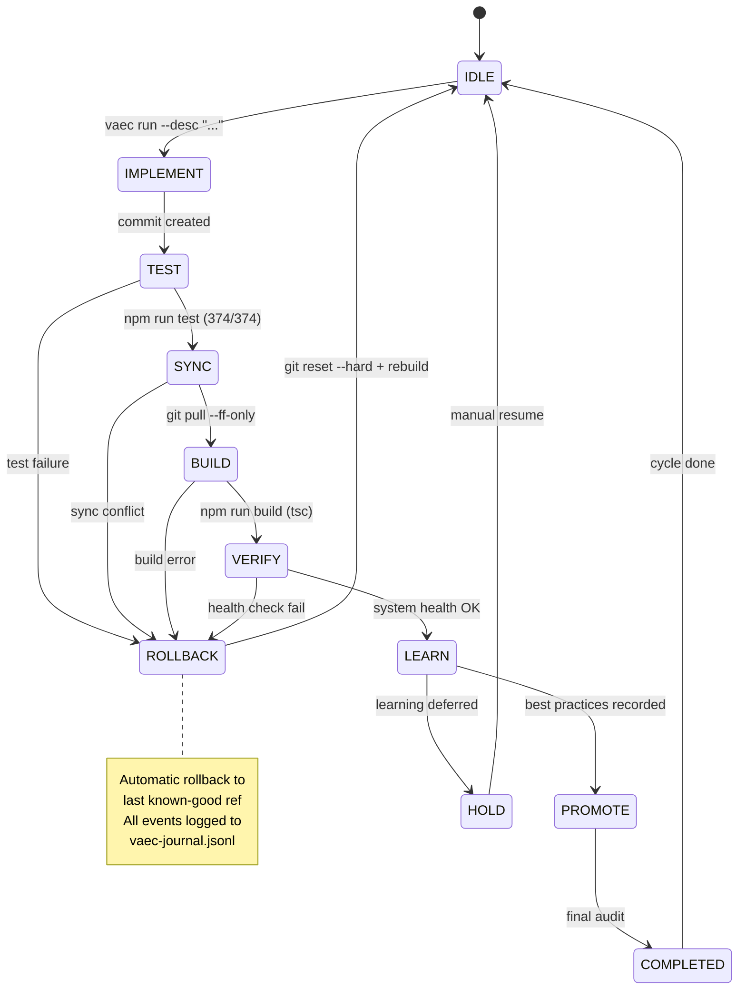
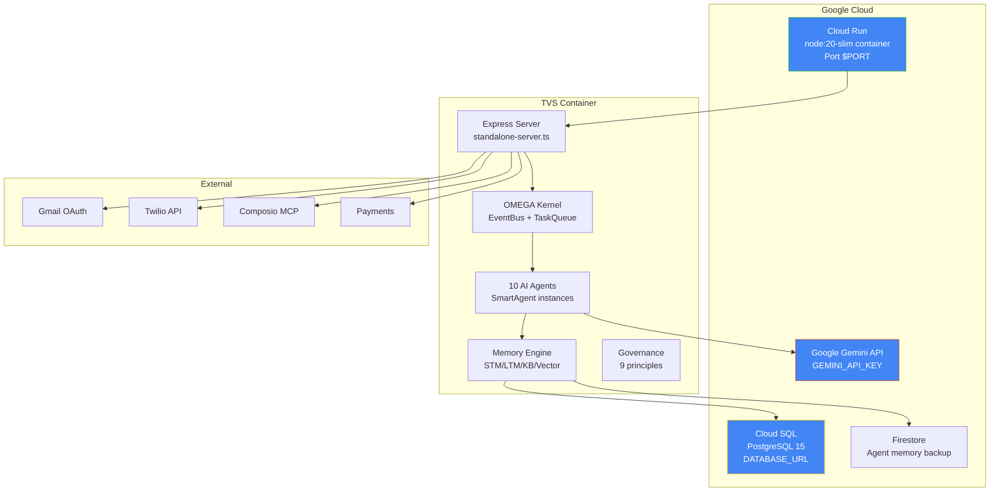
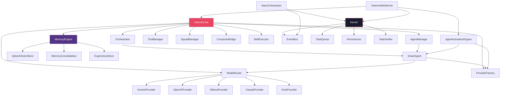

# TVS Architecture — Mermaid Diagrams

## System Overview

```mermaid
graph TB
    subgraph "Client Layer"
        UI["Web Dashboard<br/>/viseron /atlas /game"]
        API["REST API<br/>50+ endpoints"]
        VOICE["Voice Interface<br/>Web Speech STT/TTS"]
    end

    subgraph "OMEGA Kernel"
        KERNEL["Kernel<br/>src/omega/kernel/Kernel.ts"]
        EB["EventBus<br/>Wildcard pub/sub"]
        TQ["TaskQueue<br/>9-state pipeline"]
        PERM["Permissions<br/>RBAC 7 roles"]
        VER["TaskVerifier<br/>Rule-based verification"]
    end

    subgraph "Agent Fleet"
        AE["AgentActivationEngine<br/>Lifecycle management"]
        CEO["CEO Agent"]
        CTO["CTO Agent"]
        DEV["Developer Agent"]
        FIN["Finance Agent"]
        RES["Research Agent"]
        SALES["Sales Agent"]
        SEC["Security Agent"]
        SUP["Support Agent"]
        VIS["Vision Agent"]
        OPS["DevOps Agent"]
    end

    subgraph "Memory System"
        MEM["MemoryEngine<br/>4-layer memory"]
        STM["STM<br/>Session, 30min TTL"]
        LTM["LTM<br/>Persistent KV + full-text"]
        KB["Knowledge Base<br/>TF-IDF search"]
        VEC["Vector Store<br/>Qdrant embeddings"]
        GR["GraphRAG<br/>Knowledge graph"]
    end

    subgraph "AI Providers"
        ROUTER["ModelRouter<br/>Cost/quality/latency"]
        GEMINI["Gemini Flash<br/>generativelanguage.googleapis.com"]
        OLLAMA["Ollama<br/>Local qwen2.5:3b"]
        OPENAI["OpenAI<br/>GPT-4o"]
        CLOUD["Claude / Grok / OmniRoute"]
    end

    subgraph "Governance"
        GOV["Bible Governance<br/>9 ethical principles"]
        ASSO["assessOperation()<br/>Regex-based blocking"]
    end

    subgraph "Evolution"
        VAEC["VaecOrchestrator<br/>7-stage promotion gate"]
        JOURNAL["vaec-journal.jsonl<br/>Persistent audit log"]
    end

    subgraph "Google Cloud"
        CR["Cloud Run<br/>Container deployment"]
        CSQL["Cloud SQL<br/>PostgreSQL"]
        FS["Firestore<br/>Agent memory backup"]
    end

    subgraph "External Services"
        GMAIL["Gmail API<br/>OAuth2"]
        TWILIO["Twilio<br/>RCS/SMS/Telephony"]
        COMP["Composio MCP<br/>31+ SaaS integrations"]
        STRIPE["Avirato / Stripe<br/>Payments"]
    end

    UI --> API
    VOICE --> API
    API --> KERNEL

    KERNEL --> EB
    KERNEL --> TQ
    KERNEL --> PERM
    KERNEL --> VER

    KERNEL --> AE
    AE --> CEO & CTO & DEV & FIN & RES & SALES & SEC & SUP & VIS & OPS

    AE --> MEM
    MEM --> STM & LTM & KB & VEC & GR

    AE --> ROUTER
    ROUTER --> GEMINI & OLLAMA & OPENAI & CLOUD

    KERNEL --> GOV
    GOV --> ASSO

    KERNEL --> VAEC
    VAEC --> JOURNAL

    CR --> API
    CSQL --> MEM
    FS --> MEM

    API --> GMAIL & TWILIO & COMP & STRIPE

    style KERNEL fill:#1a1a2e,stroke:#e94560,color:#fff
    style EB fill:#16213e,stroke:#0f3460,color:#fff
    style TQ fill:#16213e,stroke:#0f3460,color:#fff
    style GOV fill:#533483,stroke:#e94560,color:#fff
    style VAEC fill:#533483,stroke:#e94560,color:#fff
    style GEMINI fill:#4285f4,stroke:#34a853,color:#fff
```

## Task Execution Flow

## Memory Consolidation Cycle

## VAEC Evolution Pipeline

## Deployment Architecture (Cloud Run)

## Component Dependency Map

